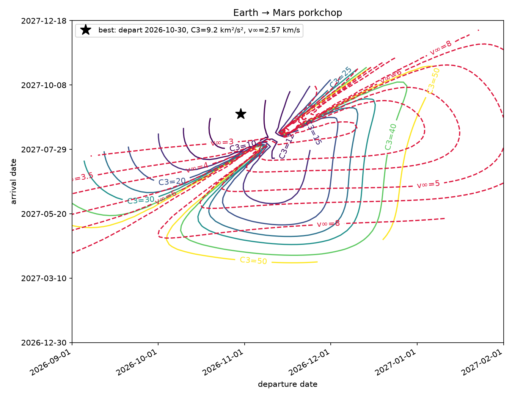

# porkchop

**Interplanetary transfer-window analysis from first principles: universal
Kepler propagation, a Lambert solver, JPL mean-element ephemerides, and
porkchop plots.**



Everything is implemented from the underlying mechanics — no astro libraries —
and validated against published ground truth:

- The Lambert solver reproduces the worked example from **Vallado,
  _Fundamentals of Astrodynamics and Applications_** (Example 7-5) to 4+
  significant figures.
- A 180° coplanar circular-to-circular Lambert arc flown in the Hohmann
  transfer time must cost the **analytic Hohmann Δv** — the classical limit.
- Lambert and the universal-variable propagator **cross-validate each other**:
  propagate any state, then solving Lambert between the endpoints must return
  the original velocities.
- Ephemerides (Standish JPL mean elements, 1800–2050) are checked for orbital
  periods, heliocentric distances vs. each planet's true
  perihelion–aphelion range, Earth's ~29.8 km/s speed, and the **Earth–Mars
  synodic realignment** (which individual cycles spread across 764–810 days —
  a physical effect of Mars's eccentricity, not noise).
- The scanned **late-2026 Earth→Mars window** must appear with the
  historically correct minimum departure C3.

## Install

```bash
pip install -e ".[dev]"
```

## Use

```bash
# Earth -> Mars, late-2026 launch window
porkchop --depart-start 2026-09-01 --depart-end 2027-02-01 --out earth_mars.png

# Any pair of the six classical planets
porkchop --origin earth --target venus \
    --depart-start 2026-01-01 --depart-end 2026-06-01 --tof-min 80 --tof-max 200
```

Or from Python:

```python
from porkchop import evaluate_transfer, julian_date

point = evaluate_transfer("earth", "mars",
                          julian_date(2026, 11, 8), julian_date(2027, 9, 15))
print(point.c3_depart, point.vinf_arrive)
```

## What's inside

| module | contents |
|---|---|
| `kepler.py` | Stumpff functions, universal-variable two-body propagation (any conic, one algorithm) |
| `lambert.py` | zero-rev universal-variable Lambert (Newton + bisection safeguard, short/long way) |
| `ephemeris.py` | JPL mean Keplerian elements + rates for Mercury–Saturn, Kepler's equation, perifocal→ecliptic rotation |
| `transfer.py` | C3 / v∞ evaluation, departure×arrival porkchop grids |
| `plot.py` | contour porkchop plots with calendar-date axes |

## Tests

```bash
pytest -q     # 27 tests
ruff check .
```

## Units and conventions

km, s, km³/s² throughout; dates as Julian dates (converters included);
heliocentric ecliptic-J2000 frame. Mean-element ephemerides are accurate to a
few thousandths of an AU inside 1800–2050 — ideal for window studies, not for
navigation.

## License

MIT
